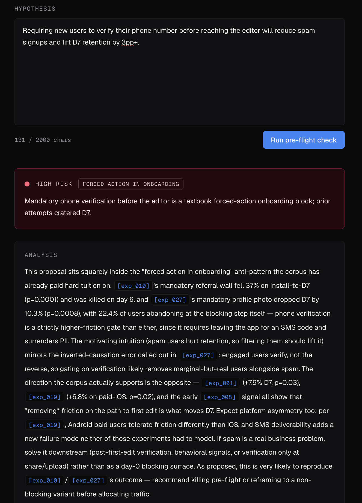

# Postmark



A memory layer for product experimentation. Built as a portfolio demonstration of Claude + RAG + structured AI judgment applied to a real product problem.

## Why this exists

Every PM ships experiments that someone on the team already ran two years ago. Search tools don't help — you don't remember the exact phrasing of a 2023 onboarding test, and Confluence search returns 40 irrelevant docs. Postmark answers the question "have we tested this?" semantically, then tells you whether the evidence says you should run it.

## What it does

**Search past experiments by meaning, not keywords.** Ask "have we tested anything around onboarding gates?" and get a ranked list of relevant past experiments with an AI-written summary citing specific tests.

**Pre-flight a hypothesis before you launch it.** Paste an experiment idea and get back a structured risk verdict — risk level, named meta-pattern, and a senior-PM analysis grounded in similar past attempts. If your idea is the third forced-action onboarding test, Postmark says so before you ship.

**Browse cross-experiment lessons.** Twelve hand-curated meta-patterns surface what 50 experiments collectively teach — what's been confirmed across multiple attempts, what's still emerging, what's been tried only once.

## Live demo

https://postmark-demo.onrender.com

## How it works

- Next.js 16 (App Router) + TypeScript + Tailwind v4
- Voyage AI embeddings (`voyage-3-large`, 1024 dims) for semantic retrieval
- `sqlite-vec` for vector search over a local SQLite file — no external vector DB
- Anthropic Claude Opus 4.7 for the pre-flight verdict (tool-use + streamed prose), Haiku 4.5 for search summaries
- All AI responses stream
- Zod for runtime validation at AI and HTTP boundaries
- MCP server (TypeScript + `@modelcontextprotocol/sdk`) exposes the same corpus to Claude Desktop

The corpus: 50 hand-curated experiments and 12 cross-experiment patterns from a fictional consumer photo app called Pixmate.

## Run locally

```bash
git clone <repo-url> postmark
cd postmark
cp .env.example .env                # then add ANTHROPIC_API_KEY and VOYAGE_API_KEY
npm install
npm run seed                        # one-time: applies migrations + embeds the 50-experiment seed
npm run dev                         # http://localhost:3000
```

Requires Node 20+.

## MCP server (for Claude Desktop)

Postmark exposes its corpus to AI assistants over MCP. Four read tools — `search_experiments`, `preflight_check`, `get_experiment`, `list_patterns` — all wrap the same library code the web app uses.

Add to your Claude Desktop config (`~/Library/Application Support/Claude/claude_desktop_config.json` on macOS):

```json
{
  "mcpServers": {
    "postmark": {
      "command": "npx",
      "args": ["tsx", "--env-file=.env", "src/mcp/server.ts"],
      "cwd": "/absolute/path/to/postmark"
    }
  }
}
```

Then in Claude Desktop, ask things like "have we tested anything like requiring phone verification on signup?" and watch Claude call the tools.

For local testing without Claude Desktop:

```bash
npm run mcp:inspect    # opens the MCP inspector UI
```

## Architecture

- Retrieval: `src/lib/search.ts` (Voyage query embedding + sqlite-vec k-NN)
- Pre-flight verdict: `src/lib/preflight.ts` (forced tool_use + streamed analysis continuation; shared by SSE and MCP)
- Patterns: `src/lib/patterns.ts` (hand-curated, not derived from tags)
- Experiment lookup: `src/lib/experiments.ts`
- Database singleton + migrations: `src/lib/db.ts`
- Rate limiting: `src/lib/rate-limit.ts` (in-memory sliding window)
- MCP server: `src/mcp/server.ts`

## Notes from building this

- **RAG quality came from the corpus, not the model.** I spent more time hand-curating 50 experiment writeups than tuning prompts. Garbage corpus, garbage answers.
- **Forced tool-use beats free-text + JSON parsing.** The pre-flight verdict uses `tool_choice` to force Claude to emit a structured `RiskVerdict` object. Eliminates entire classes of parse errors.
- **Two-call pattern: structured verdict, then streamed analysis.** Call 1 returns the verdict object (50ms parse, deterministic). Call 2 streams the analysis prose grounded in the same precedents. UI shows the verdict immediately, prose fills in.
- **Render's `x-forwarded-for` includes internal LB IPs that rotate per-request.** The standard "take the last value" rate-limiter pattern fails on Render. First-value extraction works because Cloudflare overwrites client-supplied XFF upstream.
- **Diagnostic logging is cheap; assumptions are expensive.** Identified the XFF rotation bug in one log read after a day of guessing.

## Tech notes

- **The seeded database is committed.** `data/postmark.db` ships in the repo so deployments boot without re-embedding 50 experiments. The corpus is small (4 MB) and stable, so this is the simplest reliable path.
- **Rate limiting is in-memory.** One process, one Map. Sized for Render's free tier; swap for Redis if it ever needs to scale horizontally.
- **All Pixmate data is fictional.** No real company, no real users.
- **Deployed to Render, not Vercel.** Vercel's serverless model doesn't fit `better-sqlite3`'s local file; Render gives a long-running Node process.

## Status

Built as a portfolio project. Not production software. The architecture is honest about its scope: single-user, no auth, in-memory rate limit, committed seed data. Each of those would change for a real product.

## Attribution

Hand-built by Shushan with extensive Claude Code assistance. Pixmate, the consumer photo app whose experiments populate the corpus, is fictional.
